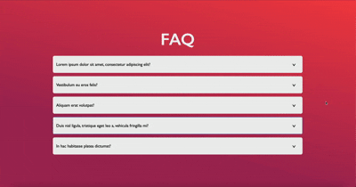

# ReactJS Accordion Component

This repository contains a customizable accordion component built with React JS. The component is designed for user-friendly interactions and smooth animations, making it a versatile addition to any project.

## Features

- **Dynamic content:** It handles dynamic data to display FAQs, sections, or expandable items.
- **Smooth transitions:** It implements smooth opening and closing animations.
- **Responsive design:** It adapts seamlessly to different screen sizes.

## Preview



## Installation

1. Clone this repository:

```[bash]
git clone https://github.com/abrilherrada/reactjs_accordion-component.git
```

2. Navigate to the project directory:

```[bash]
cd reactjs_accordion-component
```

3. Install dependencies:

```[bash]
npm install
```

## Usage

1. Import the `Accordion` component into your project:

```[jsx]
import Accordion from './Accordion';
```

2. Provide your data as props to the component:

```[jsx]
const data = [
  { title: "Section 1", content: "Content for section 1." },
  { title: "Section 2", content: "Content for section 2." },
  { title: "Section 3", content: "Content for section 3." },
];
<Accordion items={data} />;
```

## Customization

**Styling:** Modify the `accordion.css` file to adjust styles to your project's needs.

## Contributing

Contributions are welcome! Feel free to fork the repository and submit a pull request for any improvements or new features.

## License

This project is licensed under the MIT License.
